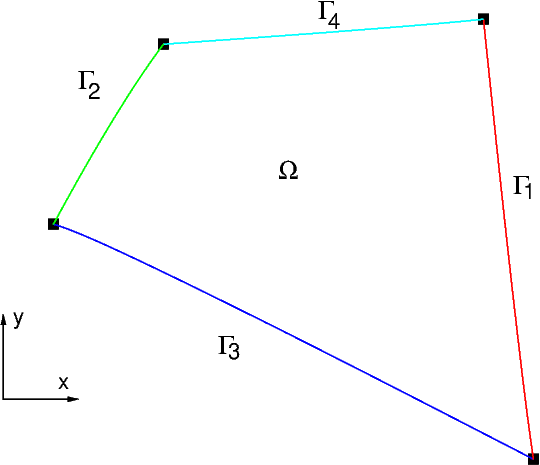

## 2D FEM project
This project is based on a course given by a professor at the University of Lyon 1, available at :
[Mr Buffat's course](https://perso.univ-lyon1.fr/marc.buffat/COURS/BOOK_ELTFINIS_HTML/CoursEF/chap4.html#conditions-aux-limites)

It is important to note that there is an error when applying the boundary conditions, hence the comment in the code.

This scheme shows the domain of the generic problem studied in this project (image from the cited course).
Each border corresponds to a specific boundary condition.
1. $\Gamma_1$ is a border driven by a Dirichlet BC (Boundary Condition), i.e. $u_{\Gamma_1} = 0$,
2. $\Gamma_1$ is a border driven by a non-homogeneous Dirichlet BC (Boundary Condition), i.e. $u_{\Gamma_1} = u_e$,
3. $\Gamma_3$ is a border driven by a Neuman BC, i.e. $(\frac{\partial u}{\partial n})_{\Gamma_3} = 0$,
4. $\Gamma_4$ is a border driven by a Fourier BC, i.e. $-K(\frac{\partial u}{\partial n})\_{\Gamma_4} = \beta u\_{\Gamma_4} + \phi_0$

Hence, the main equation is given by:
$$-\frac{\partial}{\partial x}K(\frac{\partial u}{\partial x}) -\frac{\partial}{\partial y}K(\frac{\partial u}{\partial y}) + \alpha u(x,y) = f(x,y)$$ on $\Omega$,
with the following BC:
$u_{\Gamma_1} = 0$, $u_{\Gamma_1} = u_e$, $(\frac{\partial u}{\partial n})\_{\Gamma_3} = 0$, $-K(\frac{\partial u}{\partial n})\_{\Gamma_4} = \beta u\_{\Gamma_4} + \phi_0$

For the in depth method used in this project, please refer to the course cited previously. 
