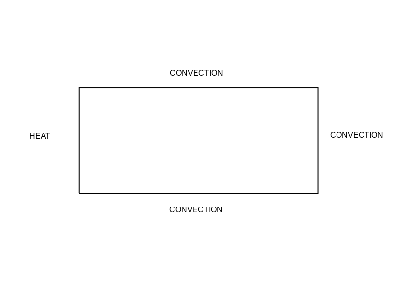
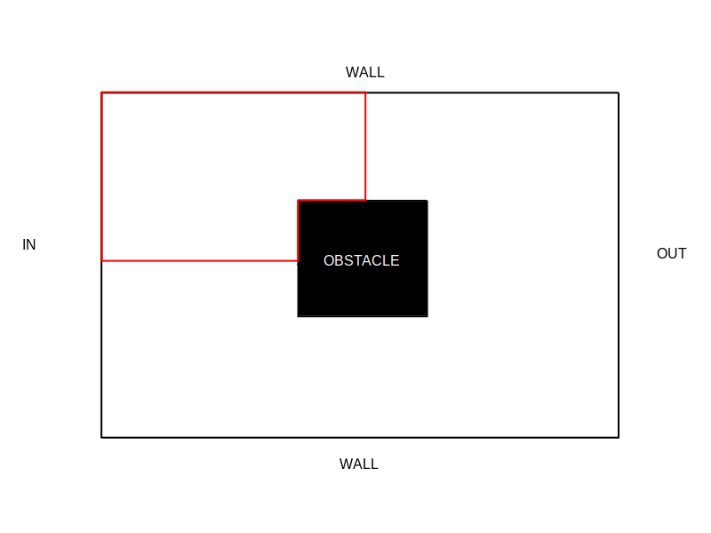

## 2D FEM project
This project is based on a course given by a professor at the University of Lyon 1, available at :
[Mr Buffat's course](https://perso.univ-lyon1.fr/marc.buffat/COURS/BOOK_ELTFINIS_HTML/CoursEF/chap4.html#conditions-aux-limites)

It is important to note that there is an error when applying the boundary conditions, hence the comment in the code.

This scheme shows the domain of the generic problem studied in this project (image from the cited course).
Each border corresponds to a specific boundary condition.
1. $\Gamma_1$ is a border driven by a Dirichlet BC (Boundary Condition), i.e. $u_{\Gamma_1} = 0$,
2. $\Gamma_2$ is a border driven by a non-homogeneous Dirichlet BC (Boundary Condition), i.e. $u_{\Gamma_2} = u_e$,
3. $\Gamma_3$ is a border driven by a Neuman BC, i.e. $(\frac{\partial u}{\partial n})_{\Gamma_3} = 0$,
4. $\Gamma_4$ is a border driven by a Fourier BC, i.e. $-K(\frac{\partial u}{\partial n})\_{\Gamma_4} = \beta u\_{\Gamma_4} + \phi_0$

Hence, the main equation is given by:
$$-\frac{\partial}{\partial x}K(\frac{\partial u}{\partial x}) -\frac{\partial}{\partial y}K(\frac{\partial u}{\partial y}) + \alpha u(x,y) = f(x,y)$$ on a domain $\Omega$,
or, if $\frac{\partial K}{\partial x} = \frac{\partial K}{\partial y} = 0$:
$$-K\Delta u + \alpha u(x,y) = f(x,y)$$
with the following BC:
$u_{\Gamma_1} = 0$, $u_{\Gamma_2} = u_e$, $(\frac{\partial u}{\partial n})\_{\Gamma_3} = 0$, $-K(\frac{\partial u}{\partial n})\_{\Gamma_4} = \beta u\_{\Gamma_4} + \phi_0$

For the in depth method used in this project, please refer to the course cited previously. 

## How to use this repository
Type `python3 cases.py n` to execute the $n^{th}$ case.
### Case 1
Resole a thermal problem (a thin plate heated on its left side), i.e. 
$$\Delta T = 0$$

The left side (HEAT) is considered as $\Gamma_2$, and the rest (CONVECTION) as $\Gamma_4$, with these constants values:
1. $K = 1$,
1. $T_e = u_e = 200$,
2. $\alpha = 0$
3. $f(x,y) = 0$
4. $\beta = 0$
5. $\phi_0 = 5$.

### Case 2
Same as the first case but with a finer meshing.

### Case 3
Resolve a potential flow problem with an obstacle.
$$\Delta \phi = 0$$

We use the symmetrical properties of the problem to reduce it to a quarter domain (in red). Then, we associate the the inlet segment (IN) to $\Gamma_2$, the walls (WALL) to $\Gamma_3$ and finally the middle symmetry to $\Gamma_1$.
In this case, we use these constants:
1. $K = 1$,
2. $u_e = 5$,
3. $\alpha = 0$
4. $f(x,y) = 0$
5. $\beta = 0$
6. $\phi_0 = 5$.

Please not that at the end, we get the values of $\phi$ and not of $\psi$. For this, we need to convert it thanks to there definition.
$u = \frac{\partial \psi}{\partial y}$,
$v = -\frac{\partial \psi}{\partial x}$,
$u = \frac{\partial \phi}{\partial x}$,
$v = \frac{\partial \phi}{\partial y}$.

### Case 4
Same as case 3, but with a finer mesh.

